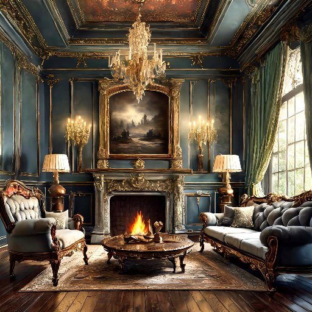

<h2> 
<a href="https://vistadream-project-page.github.io/" target="_blank">VistaDream: Sampling multiview consistent images for single-view scene reconstruction</a>
</h2>

This is the official PyTorch implementation of the following publication:

> **VistaDream: Sampling multiview consistent images for single-view scene reconstruction**<br/>
> [Haiping Wang](https://hpwang-whu.github.io/), [Yuan Liu](https://liuyuan-pal.github.io/), [Ziwei Liu](https://liuziwei7.github.io/), [Wenping Wang](https://www.cs.hku.hk/people/academic-staff/wenping), [Zhen Dong](https://dongzhenwhu.github.io/index.html), [Bisheng Yang](https://3s.whu.edu.cn/info/1025/1415.htm)<br/>
> *arXiv 2024*<br/>
> [**Paper**](https://arxiv.org/abs/2410.16892) | [**Project-page**(with Interactive DEMOs)](https://vistadream-project-page.github.io/) 


## 🔭 Introduction
<p align="center">
<strong>TL;DR: VistaDream is a training-free framework to reconstruct a high-quality 3D scene from a single-view image.</strong>
</p>

<table style="width:100%;">
  <tr>
    <td style="text-align:center; vertical-align:middle;">
      
    </td>
    <td style="text-align:center; vertical-align:middle;">
      
    </td>
    <td style="text-align:center; vertical-align:middle;">
      
    </td>
  </tr>
  <tr>
    <td style="text-align:center;">Input Image</td>
    <td style="text-align:center;">RGBs of the reconstructed scene</td>
    <td style="text-align:center;">Depths of the reconstructed scene</td>
  </tr>
  <tr>
    <td colspan="3" style="text-align:center;">
      More results and interactive demos are provided in the 
      <a href="https://vistadream-project-page.github.io/" target="_blank">Project Page</a>.
    </td>
  </tr>
</table>

<p align="justify">
  <strong>Abstract:</strong> In this paper, we propose VistaDream a novel framework to reconstruct a 3D scene from a single-view image.Recent diffusion models enable generating high-quality novel-view images from a single-view input image. 
  Most existing methods only concentrate on building the consistency between the input image and the generated images while losing the consistency between the generated images.
  VistaDream addresses this problem by a two-stage pipeline.
  In the first stage, VistaDream begins with building a global coarse 3D scaffold by zooming out a little step with outpainted boundaries and an estimated depth map. Then, on this global scaffold, we use iterative diffusion-based RGB-D inpainting to generate novel-view images to inpaint the holes of the scaffold.
  In the second stage, we further enhance the consistency between the generated novel-view images by a novel training-free Multi-view Consistency Sampling (MCS) that introduces multi-view consistency constraints in the reverse sampling process of diffusion models.
  Experimental results demonstrate that without training or fine-tuning existing diffusion models, VistaDream achieves consistent and high-quality novel view synthesis using just single-view images and outperforms baseline methods by a large margin.
</p>

## 🆕 News
- 2024-10-23: Code, [[project page]](https://vistadream-project-page.github.io/), and [[arXiv paper]](https://arxiv.org/abs/2410.16892) are aviliable.

## 💻 Requirements
The code has been tested on:
- Ubuntu 20.04
- CUDA 12.3
- Python 3.10.12
- Pytorch 2.1.0
- GeForce RTX 4090.

## 🔧 Installation
For complete installation instructions, please see [INSTALL.md](INSTALL.md).

## 🚅 Pretrained model
VistaDream is training-free but utilizes pretrained models of several existing projects.
To download pretrained models for [Fooocus](https://github.com/lllyasviel/Fooocus), [Depth-Pro](https://github.com/apple/ml-depth-pro), 
[OneFormer](https://github.com/SHI-Labs/OneFormer), [SD-LCM](https://github.com/luosiallen/latent-consistency-model), run the following command:
```
bash download_weights.sh
```
The pretrained models of [LLaVA](https://github.com/haotian-liu/LLaVA) and [Stable Diffusion-1.5](https://github.com/CompVis/stable-diffusion) will be automatically downloaded from hugging face on the first running.

## 🔦 Demo
Try VistaDream using the following commands:
```
python demo.py
```
Then, you should obtain:
- ```data/sd_readingroom/scene.pth```: the generated gaussian field;
- ```data/sd_readingroom/video_rgb(dpt).mp4```: the rgb(dpt) renderings from the scene.

## 🔦 Generate your own scene
If you need to improve the reconstruction quality of your own images, please refer to [INSTRUCT.md](pipe/cfgs/INSTRUCT.md)

To visualize the generated gaussian field, you can use the following script:
```
import torch
from ops.utils import save_ply
scene = torch.load(f'data/vistadream/piano/refine.scene.pth')
save_ply(scene,'gf.ply')
```
and feed the ```gf.ply``` to [SuperSplat](https://playcanvas.com/supersplat/editor) for visualization.

## 🔦 ToDo List
- [X] Early check in generation.
- [X] Support more types of camera trajectory. Please follow [Here](ops/trajs/TRAJECTORY.MD) to define your trajectory. An example is given in this [issue](https://github.com/WHU-USI3DV/VistaDream/issues/11).
- [ ] Gradio Demo and better visualization.
- [ ] Support sparse-view-input (and no pose needed). An example is given in this [issue](https://github.com/WHU-USI3DV/VistaDream/issues/14).
- [ ] Keep sky areas. The sky areas are deteced and removed at now for simplicity.

## 💡 Citation
If you find this repo helpful, please give us a 😍 star 😍.
Please consider citing VistaDream if this program benefits your project
```
@article{wang2024vistadream,
  title={VistaDream: Sampling multiview consistent images for single-view scene reconstruction},
  author={Haiping Wang and Yuan Liu and Ziwei Liu and Zhen Dong and Wenping Wang and Bisheng Yang},
  journal={arXiv preprint arXiv:2410.16892},
  year={2024}
}
```

## 🔗 Related Projects
We sincerely thank the excellent open-source projects:
- [Fooocus](https://github.com/lllyasviel/Fooocus) for the wonderful inpainting quality;
- [LLaVA](https://github.com/haotian-liu/LLaVA) for the wonderful image analysis and QA ability;
- [Depth-Pro](https://github.com/apple/ml-depth-pro) for the wonderful monocular metric depth estimation accuracy;
- [OneFormer](https://github.com/SHI-Labs/OneFormer) for the wonderful sky segmentation accuracy;
- [StableDiffusion](https://github.com/CompVis/stable-diffusion) for the wonderful image generation/optimization ability.
